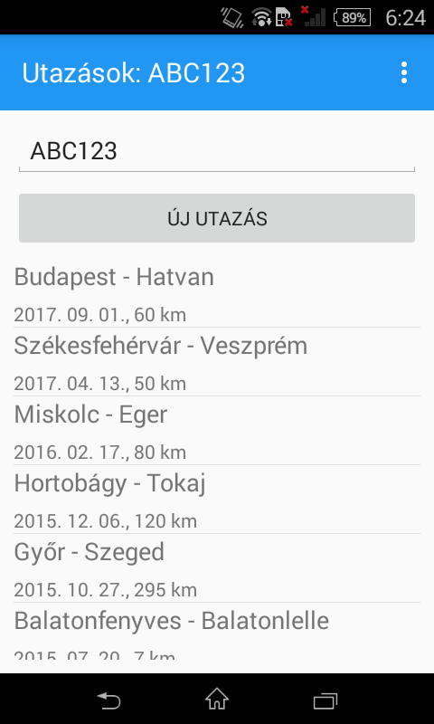
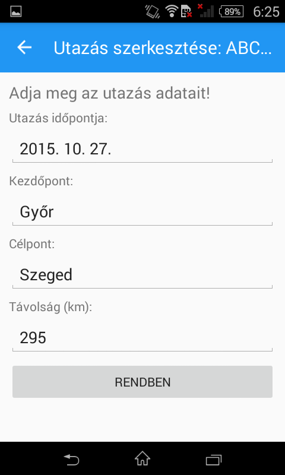
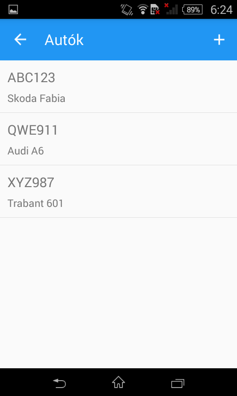

TravelRecord
============
TravelRecord is an Android application made for learning purposes, which helps to note and organize travels by multiple cars. It is written
in C# and XAML using the [Xamarin.Forms API](https://www.xamarin.com/forms), and stores data in local SQLite database.

At the moment, it only has a hungarian UI.

Dependencies
------------
* [Visual Studio](https://www.visualstudio.com/)
* [Xamarin.Forms 2.3.4.247+](https://www.nuget.org/packages/Xamarin.Forms/)
* [sqlite-net-pcl](https://www.nuget.org/packages/sqlite-net-pcl/) package

Screenshots
-----------

